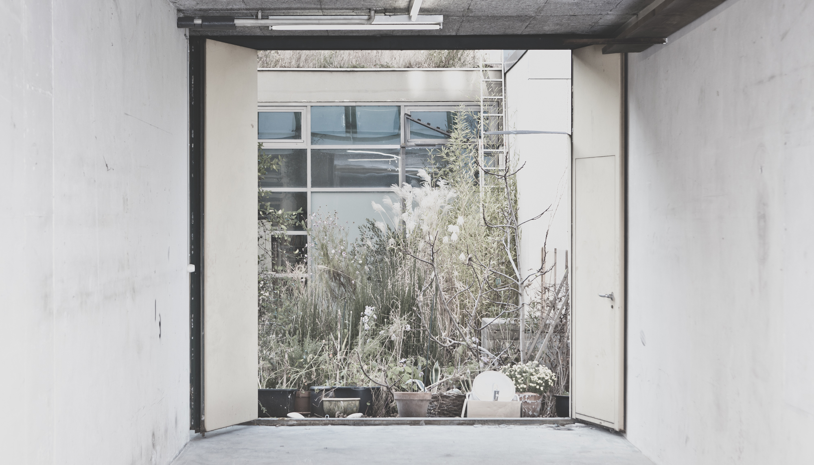
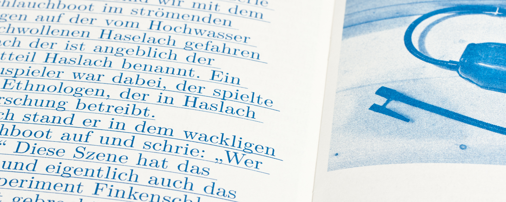
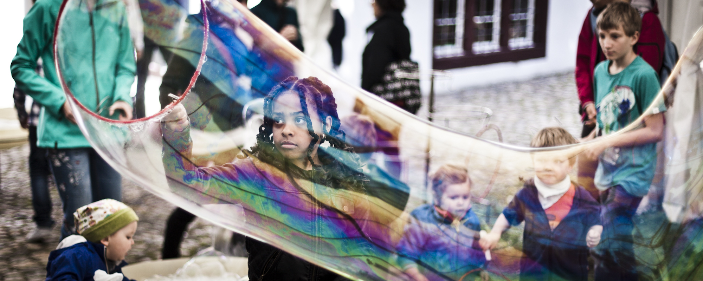
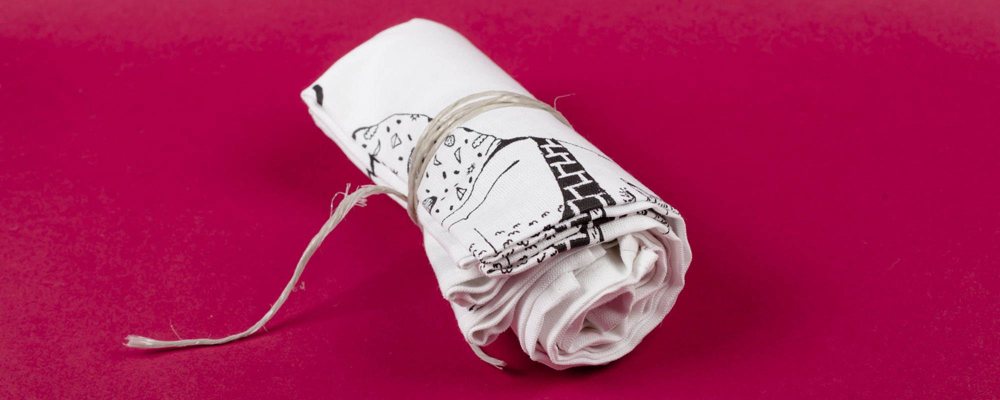
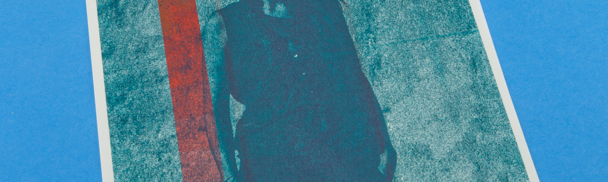

[GRAFIKDESIGN](#GRAFIKDESIGN) [FOTOGRAFIE](#FOTOGRAFIE) [SIEBDRUCK](#SIEBDRUCK) [RISOGRAPHIE](#RISOGRAPHIE)

## GRAFIKDESIGN
Schlichte und stark visuelle Produkte mit klaren Formen und Charme // Für Print und Web. // Zu Projekten:

## FOTOGRAFIE 
Ob Kunstvernissage oder Atlantiküberquerung, ob Theater Premiere oder Boxkampf. Die wichtigsten Momente aus dem Alltag und von besonderen Anlässen in narrativen Bildern festgehalten: Zu Projekten:

## SIEBDRUCK 
Vistenkarten auf extradickem Papier, Einkaufstaschen für Ihre Firma, T-Shirts für den Webshop: Die kleine Siebdruckerei ganz in Ihrer Nähe oder wenn Sie wünschen, direkt bei Ihnen vor Ort! Weitere Infos unter [www.druckbus.ch](www.druckbus.ch) oder im folgenden Text. Oder fragen Sie mit unten stehendem Formular unverbindlich an.

DRUCKBUS ist eine mobile Siebdruckanlage für den grafischen Siebdruck. Sie erfüllt alle Anforderungen für einen qualitativ hochstehenden Siebdruckprozess für kleinere bis mittlere Auflagen. 
Durch ihre Mobilität kann sie an jedem beliebigen Ort in Form von Workshops oder Auftritten eingesetzt werden und den Umgang mit einem einfachen, haptischen Druckhandwerk aufzeigen, was in der Regel hinter Ateliertüren oder industriellen Anlagen der Öffentlichkeit verborgen bleibt. Ziele sind die Vermittlung des Siebdruckhandwerks sowie die Auseinandersetzung und Bewusstseinsschärfung für kreative Entstehungsprozesse. [Preisliste DRUCKBUS](Preisliste_DRUCKBUS_Nutzung_2014.pdf)

## BOOKING

<form action="https://forms.brace.io/mail@weissheimer.ch" method="POST">
	

    <input type="text" name="titel" placeholder="TITEL">
    <input type="text" name="material" placeholder="MATERIAL / BEDRUCKSTOFF">
    <input type="text" name="auflage" placeholder="AUFLAGE">
    <input type="text" name="format" placeholder="FORMAT"> 
    <input type="text" name="farbe" placeholder="1. / 2. / 3. /4. / MEHRFARBIG">
    

    <input type="text" name="name" placeholder="NAME / VORNAME">
    <input type="text" name="telefon" placeholder="Telefon">
    <input type="email" name="_replyto" placeholder="MAIL">
    <textarea name="bemerkungen" placeholder="Bemerkungen"></textarea>
    <button type="submit">ANgebot anfordern</button>
</form>

## AUFTRAG

<form action="https://forms.brace.io/mail@weissheimer.ch" method="POST">
    

    <input type="text" name="titel" placeholder="TITEL">
    <input type="text" name="material" placeholder="MATERIAL / BEDRUCKSTOFF">
    <input type="text" name="auflage" placeholder="AUFLAGE">
    <input type="text" name="format" placeholder="FORMAT"> 
    <input type="text" name="farbe" placeholder="1. / 2. / 3. /4. / MEHRFARBIG">
    

    <input type="text" name="name" placeholder="NAME / VORNAME">
    <input type="text" name="telefon" placeholder="Telefon">
    <input type="email" name="_replyto" placeholder="MAIL">
    <textarea name="bemerkungen" placeholder="Bemerkungen"></textarea>
    <button type="submit">ANgebot anfordern</button>
</form>

## RISOGRAPHIE 
Das besondere Druckresultat macht die Risographie einzigartig! Für Liebhaber und Leute mit kleinerem Budget. Gedruckt wird ausschliesslich auf ausgewählten Papieren.

Vorhandene Farben: Schwarz / Blau / Rot / Gelb.

Die Risographie ist ein im Zylinderdruckverfahren durchgeführtes Schablonendruckverfahren nach Art der Siebdrucktechnik. Risographie zeichnet sich dadurch aus, dass die Farbe ohne Anwendung von Chemikalien und Hitze auf das Papier gebracht wird. Der ökologische Vorteil wird von günstigen Verbrauchskosten begleitet.

## Angebot

<form action="https://forms.brace.io/mail@weissheimer.ch" method="POST">
    

    <input type="text" name="titel" placeholder="TITEL">
    <input type="text" name="material" placeholder="MATERIAL / BEDRUCKSTOFF">
    <input type="text" name="auflage" placeholder="AUFLAGE">
    <input type="text" name="format" placeholder="FORMAT"> 
    <input type="text" name="farbe" placeholder="1. / 2. / 3. /4. / MEHRFARBIG">
    

    <input type="text" name="name" placeholder="NAME / VORNAME">
    <input type="text" name="telefon" placeholder="Telefon">
    <input type="email" name="_replyto" placeholder="MAIL">
    <textarea name="bemerkungen" placeholder="Bemerkungen"></textarea>
    <button type="submit">ANgebot anfordern</button>
</form>