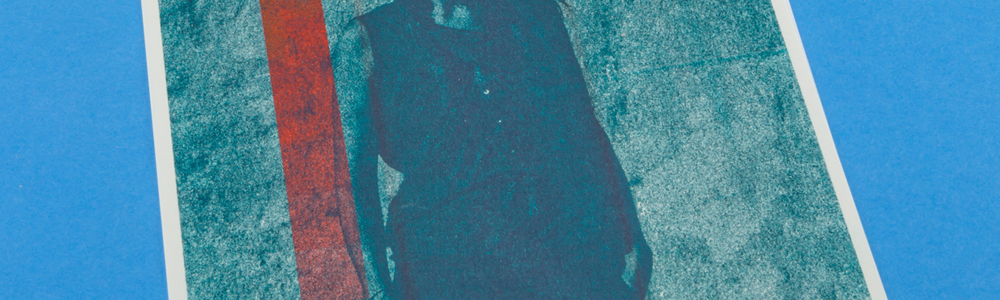

WEISSHEIMER Grafik Design ist ein Medien übergreifendes Designatelier aus Basel, welches Ende 2012 von Gaspard Weissheimer gegründet wurde. Seither ist er mit seinem Atelier im lebhaften und multikulturellen Kleinbasel zu Hause. Das Angebot umfasst Fotografische und Grafische Lösungen für Print und Web sowie manuelle Siebdruckkleinauflagen auf Papier, Textilien und weiteren Druckträgern und die Herstellung von Risographie-Drucken.

Für mobile Siebdruckeinsätze wird seit der Gründung des Ateliers 'DRUCKBUS' eingesetzt. Die mobile Siebdruckstation kann für Workshops und Veranstaltungen im privaten oder öffentlichen Raum gebucht werden. Mehr Infos finden Sie unter www.druckbus.ch

<iframe src="//player.vimeo.com/video/95943971?title=0&amp;byline=0&amp;portrait=0&amp;color=ffffff" width="2000" height="1125" frameborder="0" webkitallowfullscreen mozallowfullscreen allowfullscreen></iframe> 
<a href="http://vimeo.com/95943971">Traveling Lights</a> from <a href="http://vimeo.com/wethinkthings">we think things</a> on <a href="https://vimeo.com">Vimeo</a>.
