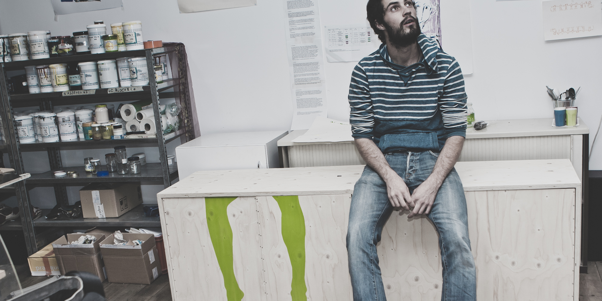

**WEISSHEIMER** Grafik Design ist ein 2013 von Gaspard Weissheimer gegründetes Designatelier aus Basel. Das Augenmerk liegt auf der Kreation von schlichten visuellen Lösungen für Print und Web, sowie fotografischen Dokumentationen diverser Veranstaltungen und Unternehmungen. Von Hand gefertigte Siebdrucke auf Papier, Textilien und weitere Druckträger und die Herstellung von Risographien runden das Angebot ab.
Für Verantstaltungen steht eine mobile Siebdruckstation 'DRUCKBUS' zur Verfügung. Die mobile Einrichtung kann für Workshops und Veranstaltungen gebucht werden. Mehr Infos finden Sie hier: [DRUCKBUS](www.druckbus.ch)

