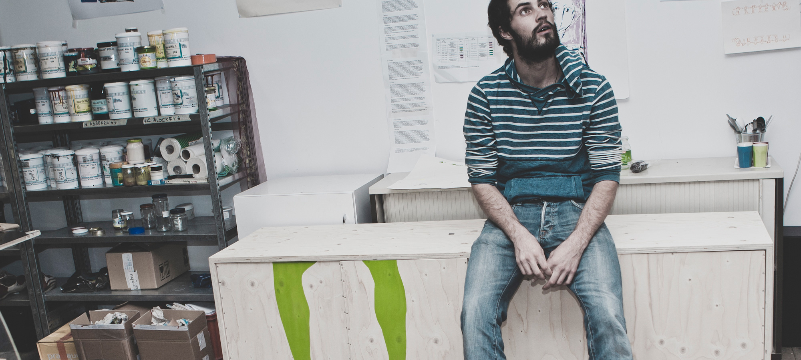

**WEISSHEIMER** Grafik Design heisst das von mir gegründete Designatelier welches ich seit 2013 in Basel betreibe. Dort entwickle ich Konzepte für schlichte visuelle [Gestaltung](www.weissheimer.ch/angebot.html) für Print und Web. Die Druckproduktion von kleineren autentischen Projketen übernehme ich nach Bedarf gerne selber, sei es mit den vielfältigen und haptisch geprägten Möglichkeiten der Siebdrucktechnik oder der weniger bekannten [Risographie-Drucktechnik](weissheimer.ch/angebot.html). Das Bild nimmt oft eine zentrale Rolle in meiner Gestaltung ein. Dafür übernehme ich gerne die Rolle des Fotografen und dokumentiere Veranstaltungen, Situationen und Unternehmungen.

Wer selber das Siebdruckhandwerk kennenlernen möchte, sollte keine Mühen scheuen und im Atelier vorbeischauen oder einen meiner Siebdruck-Events besuchen. Mit dem Projekt [DRUCKBUS](http://www.druckbus.ch) bin ich relativ unabhängig und kann für Workshops und Veranstaltungen bei dir vorbeikommen. Mehr Infos dazu findest du [hier](www.weissheimer.ch/angebot.html) oder [dort.](http://www.druckbus.ch)

 
Gaspard Weissheimer

* 2013 Gründung der Einzelfirma [**WEISSHEIMER** Grafik Design](http://www.weissheimer.ch/)
* 2012 Bachelor of Arts Fhnw, Produkt- und Industriedesign mit Vertiefung Prozessgestaltung
* Seit 2011 Vizepräsident und PR-Verantwortlicher bei [Männerstimmen Basel](http://maennerstimmen.ch/de/)
* Bachelorarbeit: [DRUCKBUS - Die mobile Siebdruckstation](http://www.druckbus.ch/)
* 2009 – 2012 Bachelor Studium HGK FHNW, [Institut Hyperwerk](http://www.hyperwerk.ch/), Abschluss: September 2012 
* Seit 2009 Sänger der [Männerstimmen Basel](http://maennerstimmen.ch/de/)
* 2009 April–Juli Praktikum bei [Stauffenegger + Stutz, Basel](http://www.st-st.ch/index.php?id=aktuell-dorfzentrum-riehen-1)
* Seit 2008 OK-Mitglied und PR-Verantwortlicher Verein Jugendprojekte [Transatlantic](http://www.vereinjugendprojekte.ch/index.php?id=322)
* 2007 – 2008 Teilnehmer Projekt [Transatlantic](http://www.fossailing.org/index.php?id=46)
* 2004–2007 Reiseleiter von 4-6-wöchigen Fahrradtouren mit Jugebdlichen im Mittelmeerraum
* 2005 – 2006 [Gestalterischer Vorkurs](http://www.sfgb-b.ch/web/sfgb/de/bildungsangebote/vkpp/vkpp_bern_biel.html), Schule für Gestaltung Biel


